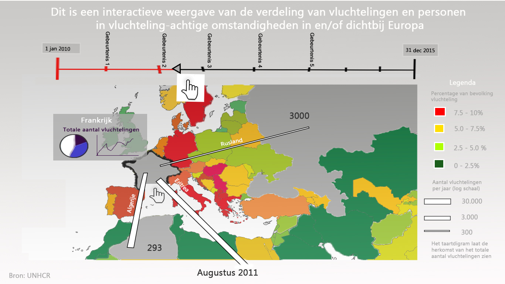

# Process book
*Jonathan Jeroen Beekman*
*10345019*

## Minimum viable product

In de schets is de visualisatie weergegeven zoals hij in het proposal document staat toegelicht. Het minimum viable product is het product waarbij van alle landen het totale aantal vluchtelingen in de landen staat weergegeven bij een hover-event, er niet-geschaalde lijnen worden getrokken van bekende migratiestromen, de tijdstappen van de bar discreet zijn in stappen van een jaar en alle landen zijn gekleurd (wanneer er geen hover-event is) met een kleur die geschaald aangeeft hoeveel vluchtenlingen er per 1000 inwoners in het land zijn.

## Framework mapping

#### A list of classes and public methods

Ik zal hier alleen de opbouw van mijn map.js beschrijven, die de visualisatie zelf 'tekent'. De bootstrap-omgeving van de HTML-pagina laat ik buiten beschouwing omdat deze grotendeels een template is.

* Op window.onload wordt een queue.awaitAll() functie aangeroepen waarbij eerst alle json's worden ingeladen. 
Deze data wordt doorgestuurd naar een functie drawMap() als alles ingeladen is.
* In drawMap() laat ik ook alle visualisaties en grafieken getekent worden. Mogelijk kan ik in drawMap() zelf 
een queue implementeren die een laadbalk over de SVG heen plaats tot de visualisatie geladen is.

**In drawMap():**
* De wereldkaart wordt ingetekend via D3. Hierbij worden alle path's die met een land corresponderen 
apart aangeroepen en op de juiste manier gekleurd volgens de huidige datum. De path-objecten krijgen hun
ISO-landcode als data mee.
* Er wordt door de path-elementen (landen) heengelooped met de functie getCountryData(countries *lijst van paths*). 
Hierbij wordt de data die correspondeert met de landcode per jaar uit alle JSON's gezocht en in een lijst gereturned.
* Met deze datalijst wordt automatisch een legenda aangemaakt met drawLegenda(countryData *lijst van strings en floats*)
* Omdat de datalijst nu automatisch in de goede volgorde staat, kan er opnieuw door de path-elementen worden
geloopt, door de datalijst uit getCountryData(countries) aan de landen toe te wijzen. Hierbij krijgt
elk path-object (land) nu de volgende waardes als data mee.
** De landnaam (ipv de code)
** Zijn x/y middelpunt (getCentre(country *path object*)
** Het totale aantal asielzoekers (getTotal(ISO code *float*, jaar *string*))
** Het aantal vluchtelingen per 1000 inwoners, per 1000km2 en per GDP, corresponderende met de kleur
die het land zal krijgen (getColor(ISO code *float*, jaar *string* en type *string*))
** De grootte en herkomst van de asielstromen naar het betreffende land toe (getFlows(ISO code *float*, jaar *string*))
* Hierbij word het land gekleurd in de correcte kleur en een text-element geplaatst met het aantal vluchtelingen in het 
betreffende land op het jaar waarop de visualisatie wordt geinitialiseerd

'Tot hier is de visualisatie werkzaam! (Jonathan, 8 januari)'

* De vluchtelingenstromen per land worden voor elk jaar als objecten over de svg heengelegd 
(drawFlow(origin *string*, asylum *string*, amount *float*) en onzichtbaar gemaakt. De stromen worden weer 
zichtbaar bij een hover-event.
* Een pop up met een lijngrafiek van het totale aantal vluchtelingen en een 100% bar-diagram wordt voor elk land en elk jaar
getekend (drawPopup(totaal asielaanvragen *lijst*, herkomst asielzoekers *lijst van lijsten*)) en onzichtbaar gemaakt. 
De popup wordt zichtbaar bij het zelfde event als de vluchtelingenstromen.

**Event: mouse hover over een land**
* De vluchtelingenstromen en pop up worden zichtbaargemaakt. Alle andere stromen en popups worden onzichtbaar gemaakt.
* Het gehoverde land en de landen waar asielzoekers vandaan komen worden wit
* De witte landen geven het totale aantal asielzoekers weer als tekst. Alle andere tekst-objecten worden onzichtbaar.

**Event: slider-bar die het jaar aangeeft wordt verschoven**
* De kleuren (fill) van de path-elementen wordt geupdate
* De inhoud van de tekst-elementen met het totale aantal asielzoekers wordt geupdate
* Alle zichtbare popups, tekstvakken, en asielstromen worden onzichtbaar gemaakt tot het volgende hover-event

#### Advanced Sketches 

#### API's and frameworks

Voor de visualisatie is in eerste plaatst een bootstrap template gebruikt, [Blue App](https://shapebootstrap.net/item/1524945-blue-app-free-one-page-responsive-html5-parallax-business-app-landing-page). Ik heb de template gestript zodat er (naast de bootstrap implementatie zelf natuurlijk) nu alleen gebruik wordt gemaakt van de fonts, een aantal jquery's voor het menu en twee bijbehorende css-bestanden. Ook was de library [modernizr](http://modernizr.com/) geimplementeerd, die zorgt voor een betere cross-browser werking. Verder wordt de library [Data Driven Documents (D3)](d3js.org) gebruikt om de wereldkaart in een svg te tekenen. De library zal ook gebruikt worden voor het implementeren van de immigratie-lijnen en grafieken bij een hover-event. Als aanvulling op D3's geo-classe is er ook een [topoJSON](http://d3js.org/topojson.v1.min.js) gebruikt, deze zorgt voor een aantal extra functies voor coördinaten en dergelijken. Tenslotte worden alle functies voor het tekenen van de wereldkaart met [queue.js](https://github.com/mbostock/queue) vastgehouden totdat alle data is ingeladen. Anders zouden er errors optreden omdat javascript functies probeert uit te voeren waar data voor nodig is.

Helaas zijn er geen API's met vluchtelingendata beschikbaar, voor zover ik heb kunnen vinden.

#### Data sources

Alle data is van UNHCR verkregen, geselecteerd, opgeschoond en in handige JSON's geplaatst. Het is te verwachten dat er nog problemen met deze JSON's zullen optreden, zoals dat er dubbele of ontbrekende datapunten problemen blijken op te leveren, maar ik verwacht niet dat dit nog veel tijd kost omdat veel van deze problemen al opgelost zijn.