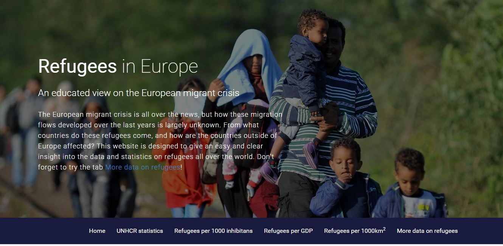
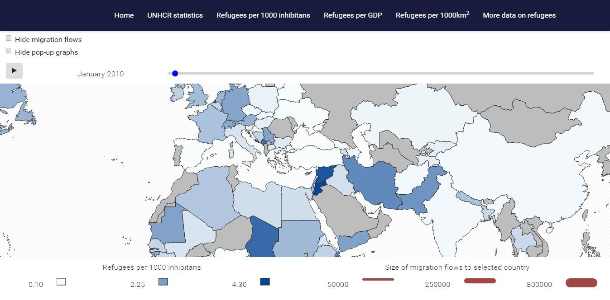
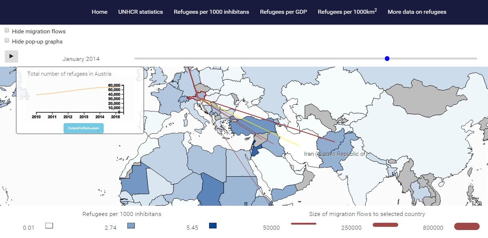
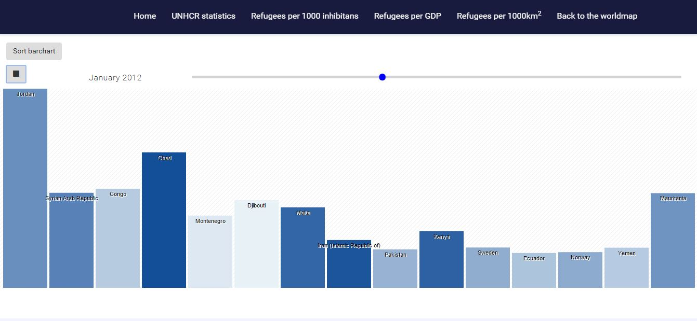

# README
*Jonathan Jeroen Beekman*
*10345019*

## Refugees in Europe
In deze repository staat de visualisatie "Refugees in Europe". Het is een visualisatie die de vluchtelingenstromen van begin 2010 tot eind 2015 zo inzichtelijk mogelijk weergeeft. De visualisatie bestaat uit twee tab-bladen: een interactieve wereldkaart, geconcentreerd rondom Europa, en een interactieve bar-grafiek.

### 1. Gebruikersfuncties

De visualisatie geeft een landkaart weer die is gefocust op Europa (het continent) en de omliggende landen. In elk land wordt weergegeven hoeveel vluchtelingen en personen in vluchteling-achtige omstandigheden er in dat land aanwezig zijn.

De kleur van elk land geeft aan welk deel (percentage) van de bevolking vluchteling is. Als de gebruiker een land aanklikt wordt er een lijngrafiek weergegeven waarop de ontwikkeling van de totale vluchtelingen populatie vanaf 2010 weergegeven wordt. Ook worden er lijnen getrokken tussen het geselecteerde land en de landan waarvanuit de belangrijkste vluchtelingenstromen NAAR het geselecteerde land komen. De dikte van deze lijnen is kwadratisch geschaald naar het aantal vluchtelingen dat deze route gebruikt. Bij de lijngrafiek krijgt de gebruiker de keuze om de grafiek uit te breiden. Hierbij wordt het grootste deel van het scherm ingekomen door een popup scherm met de volgende functies:
* Een lijndiagram waarop de grootte van de vluchtelingenstromen vanuit verschillende landen NAAR het aangeklikte land aangegeven worden van 2010 tot 2015.
* Een taartdiagram waarin het proportionele aandeel van alle vluchtelingenstromen in het geselecteerde land weergegeven worden
* Het aantal vluchtelingen per 1000 inwoners, per GDP en per 1000 km2 in het geselecteerde land
* Een 'rang' die het land inneemt ten opzichten van alle andere bij de VN-aangesloten landen in het geselecteerde jaar, op basis van deze drie getallen, waarbij de rang 1 betekent dat het land het 'hoogste' getal heeft (bijvoorbeeld Libanon heeft de meeste vluchtelingen per inwoner in 2015, en neemt in dat jaar voor dat datatype de rang 1 aan).

Als de gebruiker de muis over een land beweegt verschijnt de naam. In de menubalk kan er gewisseld worden tussen drie kleurenwaardes: het aantal vluchtelingen per 1000 inwoners, per GDP en per 1000km2. Voor meer gebruikersgemak worden deze drie variabelen in verschillende kleurencoderingen weergegeven na geselecteerd te zijn. De gebruiker kan doormiddel van het verschuiven van een slider de datum aanpassen. Ook kan er door middel van een play/stop-button gekozen worden om de tijd constant te laten afspelen.

Het doel van de visualisatie is om de gebruiker inzicht te geven in de ingewikkelde migratiepatronen die naar Europa plaatsvinden. Zo hebben vluchtelingen uit verschillende landen mogelijk ook een voorkeur voor andere landen. Daarnaast moet de visualisatie inzicht geven in de relatieve verschuiving van deze pattronen (mogelijk reisden Eritreërs eerst liever naar Duitsland, maar nu liever naar Zweden). Ten slotte, en het meest belangrijk, moet de visualisatie de gebruiker inzicht geven in hoe grote gebeurtenissen de migratiestromen hebben beinvloed.

### 2. Screenshots

### 3. Copyright statement
Deze visualisatie kan door iedereen gebruikt, verspreid en gewijzigt worden, conform met de licenties van de gebruikte libraries en templates. Zie de LICENSE-file. Het vermelden van deze github wordt gewaardeerd, maar is niet verplicht.

### 4. Sources
De bronnen staan hier onder weergegeven. Verschillende bronnen dragen ook een licenstie. Deze licenties staan in de LICENSE-file onder hun respectievelijke namen.

Data driven documents
* [d3js.org](http://www.d3js.org/)
De bootstrap library
* [http://getbootstrap.com/](http://getbootstrap.com/)
Modernizr
* [https://modernizr.com/](https://modernizr.com/)
Queue.js
* [http://bl.ocks.org/](http://bl.ocks.org/mapsam/6090056)
TopoJSON
* [https://github.com/](https://github.com/mbostock/topojson)
De achtergrond afbeelding
* [Google images zoekhit](http://images.nrc.nl/ApZVbD7S3uNrB8voAZfh0bwJ70g=/1280x/s3/static.nrc.nl/wp-content/uploads/2015/09/vluchtelingen3-2048x1490.jpeg)
Het SVG-achtergrond pattroon
* [https://bgpatterns.com/](https://bgpatterns.com/)
Simple Line graph
* [http://bl.ocks.org/](http://bl.ocks.org/d3noob/b3ff6ae1c120eea654b5)
Pie chard labels
* [http://bl.ocks.org/](http://bl.ocks.org/dbuezas/9306799)
Bargraph template 
* [http://jsfiddle.net/](http://jsfiddle.net/enigmarm/3HL4a/13/)

